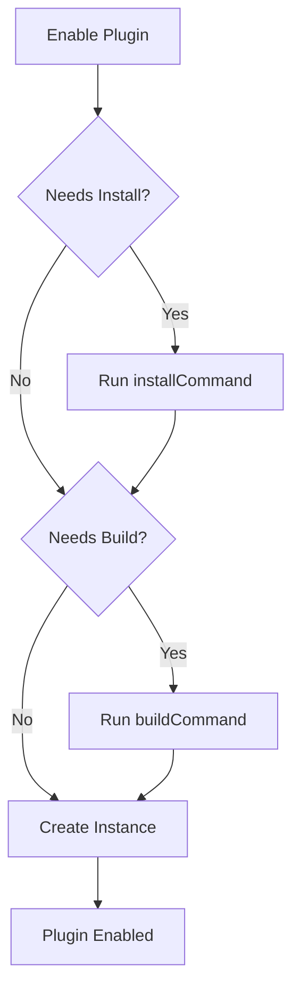

# Hay Plugin API Documentation

> **Complete guide to building, extending, and working with the Hay plugin system**

## Table of Contents

- [Overview](#overview)
- [Architecture](#architecture)
- [Plugin Manifest Reference](#plugin-manifest-reference)
- [Plugin Types](#plugin-types)
- [MCP Integration](#mcp-integration)
- [Plugin Lifecycle](#plugin-lifecycle)
- [API Reference](#api-reference)
- [Configuration Management](#configuration-management)
- [UI Extensions](#ui-extensions)
- [Channel Registration](#channel-registration)
- [Best Practices](#best-practices)
- [Building New Features](#building-new-features)
- [Troubleshooting](#troubleshooting)

---

## Overview

The Hay plugin system is a dynamic, modular architecture that allows extending platform functionality through plugins. Plugins can:

- Connect to external services via MCP (Model Context Protocol)
- Provide AI tools and capabilities
- Register communication channels
- Extend the UI with custom components
- Add API routes and backend functionality
- Implement OAuth authentication flows

### Core Principles

1. **Dynamic Loading**: Plugins are discovered and loaded at runtime
2. **Organization Isolation**: Custom plugins are scoped to organizations
3. **On-Demand Activation**: Plugin instances start only when needed
4. **MCP-First**: Built around the Model Context Protocol standard
5. **Never Hardcode**: Core code should never reference specific plugin IDs

---

## Architecture

### Directory Structure

```
plugins/
├── base/
│   └── plugin-manifest.schema.json    # JSON schema for manifests
├── core/                              # Core plugins (all orgs)
│   ├── shopify/
│   ├── stripe/
│   ├── zendesk/
│   └── ...
└── custom/                            # Custom plugins (org-specific)
    └── {organizationId}/
        └── {pluginId}/
```

### Plugin Structure

Each plugin directory contains:

```
{plugin-name}/
├── manifest.json          # Plugin configuration (REQUIRED)
├── package.json          # NPM dependencies
├── tsconfig.json         # TypeScript configuration
├── src/                  # TypeScript source code
│   └── index.ts         # Plugin entry point
├── dist/                # Compiled output
│   └── index.js         # Compiled entry (specified in manifest)
├── mcp/                 # MCP server code (if local)
│   ├── index.js         # MCP server entry
│   └── package.json     # MCP dependencies
├── components/          # Vue components (UI extensions)
│   └── settings/
│       └── CustomSettings.vue
└── public/             # Static assets
    └── icon.png
```

### System Components

#### 1. Plugin Manager Service
**Location**: `server/services/plugin-manager.service.ts`

Responsible for:
- Plugin discovery and registration
- Manifest validation
- Installation and building
- Checksum calculation
- Plugin registry management

#### 2. Plugin Instance Manager Service
**Location**: `server/services/plugin-instance-manager.service.ts`

Handles:
- On-demand instance startup
- Instance lifecycle management
- Inactivity cleanup (5-minute timeout)
- Pool limits and queueing
- Activity tracking

#### 3. Process Manager Service
**Location**: `server/services/process-manager.service.ts`

Manages:
- MCP server process lifecycle
- Process health monitoring
- Environment variable injection
- Communication via stdio/SSE/WebSocket

#### 4. MCP Client Factory
**Location**: `server/services/mcp-client-factory.service.ts`

Provides:
- MCP client creation for local/remote servers
- Connection management
- Tool invocation
- Transport protocol handling

---

## Plugin Manifest Reference

The manifest.json file is the heart of every plugin. It must conform to the schema at `plugins/base/plugin-manifest.schema.json`.

### Required Fields

```json
{
  "id": "hay-plugin-{name}",           // Unique identifier (alphanumeric + hyphens)
  "name": "Plugin Display Name",        // Human-readable name
  "version": "1.0.0",                   // Semantic version
  "description": "Plugin description",  // Brief description
  "author": "Author Name",              // Author or organization
  "type": ["mcp-connector"],           // Plugin type(s) - see Plugin Types
  "entry": "./dist/index.js"           // Compiled entry point
}
```

### Optional Core Fields

```json
{
  "enabled": true,                     // Default enabled state
  "category": "integration",           // Marketplace category
  "icon": "shopify",                   // Icon identifier or URL
  "autoActivate": false,               // Auto-start on server boot
  "invisible": false,                  // Hide from marketplace
  "trpcRouter": "./dist/router.js"    // Custom tRPC router (with autoActivate)
}
```

### Marketplace Configuration

```json
{
  "marketplace": {
    "featured": true,                  // Feature in marketplace
    "tags": ["ecommerce", "payments"], // Searchable tags
    "screenshots": [                   // Screenshot URLs
      "https://example.com/screenshot1.png"
    ]
  }
}
```

### Capabilities

The `capabilities` object defines what the plugin can do:

#### MCP Capabilities

```json
{
  "capabilities": {
    "mcp": {
      "connection": {
        "type": "local",               // "local" or "remote"
        "url": "https://mcp.example.com" // Required if type=remote
      },
      "tools": [                       // MCP tools provided
        {
          "name": "tool_name",
          "label": "Tool Display Name",
          "description": "What this tool does",
          "input_schema": {            // JSON Schema for parameters
            "type": "object",
            "properties": {
              "param1": {
                "type": "string",
                "description": "Parameter description"
              }
            },
            "required": ["param1"]
          }
        }
      ],
      "transport": "sse|websocket|http", // Transport protocol(s)
      "auth": ["apiKey"],                // Auth methods - see Authentication
      "installCommand": "npm install",   // Install dependencies
      "buildCommand": "npm run build",   // Build command (optional)
      "startCommand": "node mcp/index.js" // Start MCP server
    }
  }
}
```

#### UI Capabilities

```json
{
  "capabilities": {
    "ui": {
      "routes": [                      // Custom routes
        {
          "path": "/plugins/myplugin",
          "component": "./components/Page.vue",
          "name": "my-plugin-page",
          "meta": {
            "title": "My Plugin",
            "requiresAuth": true
          }
        }
      ],
      "components": [                  // Reusable components
        {
          "name": "MyComponent",
          "path": "./components/MyComponent.vue"
        }
      ]
    }
  }
}
```

#### API Capabilities

```json
{
  "capabilities": {
    "api": {
      "routes": [                      // Custom API routes
        {
          "method": "POST",
          "path": "/webhook",
          "handler": "./handlers/webhook.js",
          "middleware": ["auth"]
        }
      ]
    }
  }
}
```

### Authentication

#### Simple Auth Methods

```json
{
  "capabilities": {
    "mcp": {
      "auth": ["apiKey"]               // or ["oauth2"], ["jwt"], or []
    }
  }
}
```

#### OAuth 2.0 Configuration

```json
{
  "capabilities": {
    "mcp": {
      "auth": {
        "methods": ["oauth2", "apiKey"],
        "oauth": {
          "authorizationUrl": "https://provider.com/oauth/authorize",
          "tokenUrl": "https://provider.com/oauth/token",
          "scopes": ["read", "write"],          // Required scopes
          "optionalScopes": ["admin"],          // Optional scopes
          "pkce": true,                         // Enable PKCE
          "clientIdEnvVar": "PLUGIN_CLIENT_ID",
          "clientSecretEnvVar": "PLUGIN_CLIENT_SECRET"
        }
      }
    }
  }
}
```

### Configuration Schema

Define user-configurable fields:

```json
{
  "configSchema": {
    "apiKey": {
      "type": "string",
      "description": "Your API key for authentication",
      "label": "API Key",
      "placeholder": "sk_live_...",
      "required": true,
      "encrypted": true,               // Store encrypted in database
      "env": "PLUGIN_API_KEY",        // Environment variable name
      "regex": "^sk_(test|live)_.*"   // Validation regex (optional)
    },
    "webhookUrl": {
      "type": "string",
      "description": "Webhook endpoint URL",
      "label": "Webhook URL",
      "required": false,
      "default": "https://example.com/webhook"
    }
  }
}
```

**Supported field types**: `string`, `number`, `boolean`, `array`, `object`

### Permissions

```json
{
  "permissions": {
    "env": [                           // Required environment variables
      "SHOPIFY_ACCESS_TOKEN",
      "MYSHOPIFY_DOMAIN"
    ],
    "scopes": [                        // Required permission scopes
      "org:<orgId>:mcp:invoke"
    ],
    "api": [                           // Platform APIs (Plugin API pattern)
      "email"                          // Only declared APIs can be accessed
    ]
  }
}
```

### UI Extensions

#### Settings Extensions

Add UI to plugin settings pages:

```json
{
  "settingsExtensions": [
    {
      "slot": "before-settings",       // "before-settings", "after-settings", or "tab"
      "component": "components/settings/CustomSection.vue",
      "tabName": "Advanced",           // Required if slot="tab"
      "tabOrder": 1                    // Order of tab (optional)
    }
  ]
}
```

---

## Plugin Types

Plugins can have multiple types for categorization:

### Available Types

| Type | Description | Use Case |
|------|-------------|----------|
| `channel` | Communication channel integration | WhatsApp, Telegram, Email |
| `mcp-connector` | Connects to MCP servers | Stripe, Shopify, remote APIs |
| `retriever` | Data retrieval capabilities | Knowledge bases, search |
| `playbook` | Workflow automation | Pre-defined workflows |
| `workflow` | Advanced workflow capabilities | Complex automation |
| `analytics` | Analytics and reporting | Dashboards, metrics |

### Categories

For marketplace organization:

- `integration` - External service integrations
- `chat` - Chat and communication
- `analytics` - Analytics and insights
- `automation` - Automation tools
- `utility` - Utility functions

---

## MCP Integration

### Connection Types

#### Local MCP Server

Plugin hosts its own MCP server:

```json
{
  "capabilities": {
    "mcp": {
      "connection": {
        "type": "local"
      },
      "serverPath": "./mcp/index.js",
      "transport": "sse|websocket|http",
      "startCommand": "node mcp/index.js"
    }
  }
}
```

The MCP server:
- Runs as a child process
- Receives environment variables from configuration
- Communicates via specified transport
- Auto-restarts on failure

#### Remote MCP Server

Connect to external MCP server:

```json
{
  "capabilities": {
    "mcp": {
      "connection": {
        "type": "remote",
        "url": "https://mcp.stripe.com"
      },
      "transport": "http",
      "auth": {
        "methods": ["oauth2"]
      }
    }
  }
}
```

### Tool Definition

Each tool must specify:

```json
{
  "name": "create_product",            // Function identifier
  "label": "Create Product",           // Human-readable name
  "description": "Creates a new product in the store",
  "input_schema": {                    // JSON Schema
    "type": "object",
    "properties": {
      "title": {
        "type": "string",
        "description": "Product title"
      },
      "price": {
        "type": "number",
        "description": "Product price",
        "minimum": 0
      }
    },
    "required": ["title", "price"]
  }
}
```

### Transport Protocols

- **stdio**: Standard input/output (for local servers)
- **sse**: Server-Sent Events (HTTP streaming)
- **websocket**: WebSocket connection
- **http**: HTTP request/response

Multiple transports: `"sse|websocket|http"`

---

## Plugin Lifecycle

### Discovery and Registration

1. **Server Startup**: Plugin Manager scans directories
2. **Manifest Loading**: Reads and validates manifest.json
3. **Schema Validation**: Validates against plugin-manifest.schema.json
4. **Registry Update**: Upserts plugin in database with checksum
5. **Router Loading**: Auto-activated plugins load tRPC routers

### Installation Flow

When a plugin is enabled:



### Instance Management

#### On-Demand Startup

Instances start when first needed:

1. **API Request**: Tool invocation requested
2. **Check Running**: Is instance already running?
3. **Pool Check**: Are we at max concurrent instances?
4. **Start Process**: Launch MCP server with config
5. **Activity Track**: Record startup timestamp
6. **Ready**: Instance available for use

#### Inactivity Cleanup

Background job runs every minute:

- **Threshold**: 5 minutes of inactivity
- **Detection**: No tool invocations in timeframe
- **Action**: Stop MCP server process
- **Restart**: Next request starts instance again

#### Pool Limits

- **Default**: 10 concurrent instances per plugin
- **Configurable**: Via `maxConcurrentInstances` in registry
- **Queueing**: Requests wait for available slot (30s timeout)

### Configuration Updates

When configuration changes:

1. **Update Database**: Save encrypted configuration
2. **Restart Required**: MCP server must restart to pick up changes
3. **Stop Instance**: If running, stop the instance
4. **Next Request**: Will start with new configuration

---

## API Reference

### tRPC Endpoints

All plugin APIs are under `/v1/plugins`:

#### Get All Plugins

```typescript
const plugins = await Hay.plugins.getAll.query();

// Returns:
interface Plugin {
  id: string;                  // Plugin ID
  dbId: number;               // Database ID
  name: string;               // Display name
  version: string;            // Version
  type: string[];             // Plugin types
  description: string;        // Description
  installed: boolean;         // Installation status
  built: boolean;             // Build status
  enabled: boolean;           // Enabled for this org
  hasConfiguration: boolean;  // Has configSchema
  hasCustomUI: boolean;       // Has UI components
  capabilities: object;       // Capabilities object
  sourceType: 'core' | 'custom';
  isCustom: boolean;
}
```

#### Get Plugin Details

```typescript
const plugin = await Hay.plugins.get.query({
  pluginId: 'hay-plugin-shopify'
});
```

#### Enable Plugin

```typescript
const result = await Hay.plugins.enable.mutate({
  pluginId: 'hay-plugin-shopify',
  configuration: {
    shopifyAccessToken: 'shpat_xxxxx',
    myshopifyDomain: 'my-store.myshopify.com'
  }
});
```

#### Disable Plugin

```typescript
await Hay.plugins.disable.mutate({
  pluginId: 'hay-plugin-shopify'
});
```

#### Update Configuration

```typescript
await Hay.plugins.updateConfig.mutate({
  pluginId: 'hay-plugin-shopify',
  configuration: {
    shopifyAccessToken: 'new-token'
  }
});
```

#### Get Configuration

```typescript
const config = await Hay.plugins.getConfig.query({
  pluginId: 'hay-plugin-shopify'
});

// Returns decrypted configuration
```

#### Invoke MCP Tool

```typescript
const result = await Hay.plugins.invokeTool.mutate({
  pluginId: 'hay-plugin-shopify',
  toolName: 'get-products',
  arguments: {
    searchTitle: 'T-Shirt',
    limit: 10
  }
});
```

#### Health Check

```typescript
const health = await Hay.plugins.healthCheck.query({
  pluginId: 'hay-plugin-shopify'
});

// Returns:
interface HealthCheck {
  success: boolean;
  status: 'healthy' | 'unhealthy' | 'unconfigured';
  message?: string;
  error?: string;
  testedAt: Date;
}
```

#### Upload Custom Plugin

```typescript
const formData = new FormData();
formData.append('file', zipFile);

const result = await fetch('/v1/plugins/upload', {
  method: 'POST',
  body: formData,
  headers: {
    'Authorization': `Bearer ${token}`,
    'x-organization-id': organizationId
  }
});
```

### Service APIs

#### Plugin Manager

```typescript
import { pluginManagerService } from '@server/services/plugin-manager.service';

// Get all plugins
const plugins = pluginManagerService.getAllPlugins();

// Get specific plugin
const plugin = pluginManagerService.getPlugin('hay-plugin-shopify');

// Install plugin
await pluginManagerService.installPlugin('hay-plugin-shopify');

// Build plugin
await pluginManagerService.buildPlugin('hay-plugin-shopify');

// Check if needs installation/build
const needsInstall = pluginManagerService.needsInstallation('hay-plugin-shopify');
const needsBuild = pluginManagerService.needsBuilding('hay-plugin-shopify');
```

#### Plugin Instance Manager

```typescript
import { pluginInstanceManagerService } from '@server/services/plugin-instance-manager.service';

// Ensure instance is running (starts on-demand)
await pluginInstanceManagerService.ensureInstanceRunning(
  organizationId,
  'hay-plugin-shopify'
);

// Update activity timestamp (keeps instance alive)
await pluginInstanceManagerService.updateActivityTimestamp(
  organizationId,
  'hay-plugin-shopify'
);

// Get statistics
const stats = await pluginInstanceManagerService.getStatistics();

// Stop all instances for an organization
await pluginInstanceManagerService.stopAllForOrganization(organizationId);
```

#### Process Manager

```typescript
import { processManagerService } from '@server/services/process-manager.service';

// Start plugin process
await processManagerService.startPlugin(organizationId, 'hay-plugin-shopify');

// Stop plugin process
await processManagerService.stopPlugin(organizationId, 'hay-plugin-shopify');

// Check if running
const isRunning = processManagerService.isRunning(organizationId, 'hay-plugin-shopify');

// Get running processes
const processes = processManagerService.getRunningProcesses();
```

---

## Configuration Management

### Configuration Flow

1. **User Input**: User enters configuration in dashboard
2. **Validation**: Backend validates against configSchema
3. **Encryption**: Sensitive fields (encrypted: true) are encrypted
4. **Storage**: Stored in plugin_instances.configuration JSONB
5. **Environment Variables**: Mapped to env vars when starting MCP server

### Encryption

Fields marked `encrypted: true` are:
- Encrypted at rest using AES-256-GCM
- Decrypted only when needed
- Never exposed in API responses
- Injected as environment variables to MCP server

### Environment Variable Mapping

Configuration fields map to environment variables:

```json
{
  "configSchema": {
    "apiKey": {
      "type": "string",
      "env": "SHOPIFY_API_KEY",     // Maps to SHOPIFY_API_KEY
      "encrypted": true
    }
  }
}
```

When the MCP server starts:
```bash
SHOPIFY_API_KEY=decrypted_value node mcp/index.js
```

### Best Practices

1. **Always encrypt secrets**: API keys, tokens, passwords
2. **Use descriptive env var names**: Match the service's conventions
3. **Provide defaults**: For non-sensitive configuration
4. **Validate input**: Use regex patterns for format validation
5. **Clear descriptions**: Help users understand what's needed

---

## UI Extensions

### Settings Extensions

Add custom UI to plugin settings pages using Vue components.

#### Before/After Settings

Add content before or after the main settings form:

```json
{
  "settingsExtensions": [
    {
      "slot": "after-settings",
      "component": "components/settings/Instructions.vue"
    }
  ]
}
```

#### Custom Tabs

Add entire tabs to settings:

```json
{
  "settingsExtensions": [
    {
      "slot": "tab",
      "component": "components/settings/AdvancedSettings.vue",
      "tabName": "Advanced",
      "tabOrder": 1
    }
  ]
}
```

### Component Access

Your Vue components have access to:

```vue
<script setup lang="ts">
import { Hay } from '@/utils/api';
import { usePluginStore } from '@/stores/plugin';

// Access plugin configuration
const config = await Hay.plugins.getConfig.query({ pluginId: 'hay-plugin-myplugin' });

// Update configuration
await Hay.plugins.updateConfig.mutate({
  pluginId: 'hay-plugin-myplugin',
  configuration: { newValue: 'updated' }
});

// Use Nuxt features
const router = useRouter();
const route = useRoute();
</script>
```

### OAuth Connection Component

For OAuth-enabled plugins, use the OAuthConnection component:

```vue
<template>
  <OAuthConnection
    :plugin-id="pluginId"
    :oauth-config="oauthConfig"
  />
</template>
```

---

## Channel Registration

Plugins can register custom communication channels (sources) for handling messages from various platforms.

### Source Model

```typescript
interface Source {
  id: string;                    // Unique identifier
  name: string;                  // Display name
  description?: string;          // Channel description
  category: SourceCategory;      // Category enum
  pluginId?: string;             // Plugin that registered this
  isActive: boolean;             // Active status
  icon?: string;                 // Icon identifier
  metadata?: Record<string, unknown>; // Plugin-specific config
}

enum SourceCategory {
  TEST = 'test',
  MESSAGING = 'messaging',
  SOCIAL = 'social',
  EMAIL = 'email',
  HELPDESK = 'helpdesk',
}
```

### Registering a Source

```typescript
// In your plugin initialization
const source = await trpc.sources.register.mutate({
  id: 'whatsapp',                    // or 'my-plugin:whatsapp'
  name: 'WhatsApp Business',
  description: 'WhatsApp Business API integration',
  category: 'messaging',
  pluginId: 'whatsapp-plugin',
  icon: 'whatsapp',
  metadata: {
    apiVersion: '2.0',
    capabilities: ['text', 'media', 'templates']
  }
});
```

### Source ID Conventions

- **Simple format**: `whatsapp`, `telegram` - for well-known channels
- **Namespaced**: `my-plugin:custom-channel` - for custom channels
- **Pattern**: `/^[a-z0-9_:-]+$/` - lowercase, alphanumeric, dashes, underscores, colons

### Creating Messages with Sources

When creating messages from your plugin, specify the sourceId:

```typescript
import { MessageService } from '@server/services/core/message.service';

const messageService = new MessageService();

// Create message with test mode handling
const message = await messageService.createAssistantMessageWithTestMode(
  conversation,
  'Hello from WhatsApp!',
  'whatsapp',  // sourceId
  agent,
  organization,
  {
    whatsappMessageId: 'wamid.xxxxx',
    phoneNumber: '+1234567890'
  }
);

// Check delivery state
if (message.deliveryState === 'queued') {
  // Message needs approval (test mode)
  console.log('Message queued for approval');
} else {
  // Message approved automatically
  await sendToExternalPlatform(message);
}
```

### Source Management

```typescript
// Deactivate source
await trpc.sources.deactivate.mutate({ id: 'whatsapp' });

// Activate source
await trpc.sources.activate.mutate({ id: 'whatsapp' });

// List all sources
const sources = await trpc.sources.list.query();

// Get by category
const messagingSources = await trpc.sources.getByCategory.query({
  category: 'messaging'
});
```

See [docs/PLUGIN_CHANNEL_REGISTRATION.md](./PLUGIN_CHANNEL_REGISTRATION.md) for detailed guide.

---

## Best Practices

### Development

1. **Follow the schema**: Always validate your manifest against the JSON schema
2. **Version properly**: Use semantic versioning (MAJOR.MINOR.PATCH)
3. **Document tools**: Provide clear descriptions for all MCP tools
4. **Handle errors**: Implement proper error handling in MCP servers
5. **Test thoroughly**: Test installation, configuration, and tool invocation

### Security

1. **Encrypt secrets**: Mark all sensitive fields as encrypted
2. **Validate input**: Use regex patterns and type validation
3. **Least privilege**: Request only necessary OAuth scopes
4. **Secure communication**: Use HTTPS for remote MCP servers
5. **Never log secrets**: Don't log configuration or tokens

### Performance

1. **Optimize startup**: Fast MCP server startup improves UX
2. **Handle inactivity**: Design for automatic shutdown after 5 minutes
3. **Efficient tools**: Keep tool execution fast (<5 seconds ideal)
4. **Cache when possible**: Cache expensive operations
5. **Monitor resources**: Be mindful of memory and CPU usage

### Architecture

1. **Don't hardcode plugin IDs**: Use dynamic discovery
2. **Respect organization boundaries**: Custom plugins are org-scoped
3. **Follow MCP standards**: Implement proper MCP protocol
4. **Use TypeScript**: Type safety prevents runtime errors
5. **Modular design**: Keep plugins focused and single-purpose

### Documentation

1. **Clear README**: Document setup and configuration
2. **Example usage**: Provide example tool invocations
3. **Troubleshooting**: Common issues and solutions
4. **API documentation**: Document all tools and parameters
5. **Update CLAUDE.md**: Add plugin-specific guidance if needed

---

## Building New Features

### Adding a New Plugin Type

1. **Update Schema**: Add new type to `plugins/base/plugin-manifest.schema.json`
2. **Update Types**: Add to TypeScript types in `server/types/plugin.types.ts`
3. **Handle in Code**: Update plugin manager to handle new type
4. **Document**: Add to this documentation

### Adding New Plugin Capabilities

1. **Define Schema**: Add capability to manifest schema
2. **Implement Handler**: Create service to handle the capability
3. **Add API**: Expose via tRPC if needed
4. **Test**: Create test plugin using the capability
5. **Document**: Add to capabilities section

### Adding Plugin API Permissions

The `permissions.api` field uses the Plugin API pattern - plugins can only access platform APIs they explicitly declare:

1. **Define API**: Create the API service (e.g., EmailService)
2. **Add to Schema**: Add to `permissions.api` enum in manifest schema
3. **Check Permission**: Verify plugin has permission before allowing access
4. **Document**: Add to API reference

Example:
```json
{
  "permissions": {
    "api": ["email", "sms"]  // Plugin can access email and SMS APIs
  }
}
```

### Extending MCP Support

1. **New Transport**: Implement transport in MCP client factory
2. **New Auth Method**: Add to auth handling in process manager
3. **Tool Enhancements**: Update tool invocation logic
4. **Test**: Verify with real MCP server
5. **Document**: Update MCP integration section

### Custom tRPC Routers

Plugins can provide their own tRPC routers:

1. **Create Router**: Export router from plugin
```typescript
// plugins/my-plugin/dist/router.js
export const router = trpcRouter({
  myEndpoint: publicProcedure.query(() => {
    return { message: 'Hello from plugin' };
  })
});
```

2. **Reference in Manifest**:
```json
{
  "autoActivate": true,
  "trpcRouter": "./dist/router.js"
}
```

3. **Access**: Call via `Hay.plugins.myPlugin.myEndpoint.query()`

---

## Troubleshooting

### Plugin Not Appearing

**Problem**: Plugin not visible in marketplace

**Solutions**:
- Check manifest.json exists and is valid JSON
- Verify plugin ID matches pattern `/^[a-z0-9-]+$/`
- Check `invisible` field is not `true`
- For custom plugins, verify in correct org directory
- Check server logs for validation errors

### Installation Failures

**Problem**: Plugin installation fails

**Solutions**:
- Check `installCommand` in manifest
- Verify package.json exists in plugin directory
- Ensure network access for npm install
- Check for native dependency issues
- Review installation logs in console

### Build Failures

**Problem**: Plugin build fails

**Solutions**:
- Check `buildCommand` in manifest
- Verify TypeScript configuration
- Check for compilation errors
- Ensure all dependencies installed
- Review build logs

### MCP Server Won't Start

**Problem**: Plugin instance fails to start

**Solutions**:
- Verify `startCommand` is correct
- Check MCP server code for errors
- Ensure required environment variables set
- Check port availability
- Review process manager logs
- Verify file permissions

### Tool Invocation Errors

**Problem**: Tool calls fail or timeout

**Solutions**:
- Verify tool name matches manifest
- Check input_schema validation
- Ensure MCP server is running
- Check tool implementation for errors
- Verify authentication credentials
- Check network connectivity for remote servers

### Configuration Not Working

**Problem**: Configuration changes not taking effect

**Solutions**:
- Stop and restart the plugin instance
- Verify configuration saved in database
- Check environment variable mapping
- Ensure encrypted fields are decrypting
- Review MCP server startup logs

### OAuth Authentication Issues

**Problem**: OAuth flow fails

**Solutions**:
- Verify OAuth URLs are correct
- Check client ID and secret configuration
- Ensure redirect URI is registered
- Verify scopes are valid
- Check PKCE requirements
- Review OAuth provider logs

---

## Additional Resources

- **Plugin Generation**: See `.claude/PLUGIN_GENERATION_WORKFLOW.md`
- **Channel Registration**: See `docs/PLUGIN_CHANNEL_REGISTRATION.md`
- **Database Conventions**: See `server/database/DATABASE_CONVENTIONS.md`
- **Frontend Guidelines**: See `.claude/FRONTEND.md`
- **Example Plugins**: Browse `plugins/core/` directory

---

## Getting Help

- **Issues**: Open an issue in the repository
- **Examples**: Study existing plugins in `plugins/core/`
- **Community**: Join the Hay developer community
- **Documentation**: This guide and related docs in `/docs`

---

**Last Updated**: 2025-12-03
**Version**: 1.0.0
