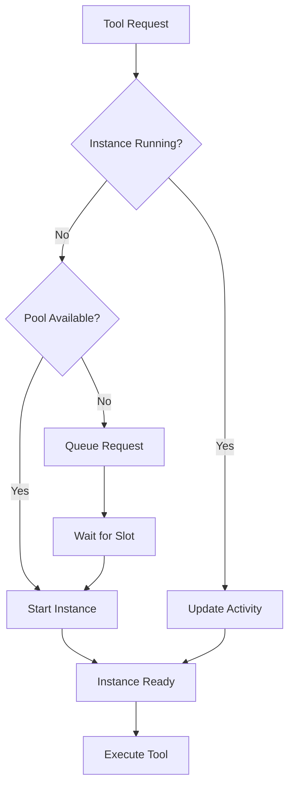
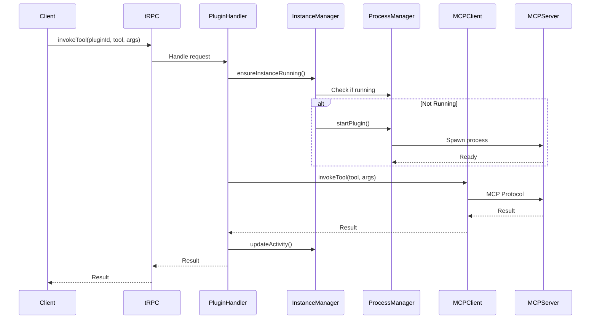

# Plugin System Development Guide

> **Guide for extending and improving the Hay plugin system itself**

This document is for developers working on the plugin system infrastructure, not for plugin authors. If you're building a plugin, see [PLUGIN_API.md](./PLUGIN_API.md) instead.

## Table of Contents

- [System Architecture](#system-architecture)
- [Adding New Capabilities](#adding-new-capabilities)
- [Extending Plugin Types](#extending-plugin-types)
- [Adding Platform APIs](#adding-platform-apis)
- [Improving MCP Support](#improving-mcp-support)
- [Enhancing Security](#enhancing-security)
- [Performance Optimization](#performance-optimization)
- [Testing Strategy](#testing-strategy)

---

## System Architecture

### Core Services

#### Plugin Manager Service
**File**: `server/services/plugin-manager.service.ts`

**Responsibilities**:
- Discovering plugins from filesystem
- Loading and validating manifests
- Managing plugin registry (database)
- Installation and build orchestration
- Checksum calculation for change detection

**Key Methods**:
```typescript
async initialize(): Promise<void>
async registerPlugin(path, sourceType, orgId): Promise<void>
async installPlugin(pluginId): Promise<void>
async buildPlugin(pluginId): Promise<void>
getPlugin(pluginId): PluginRegistry | undefined
getAllPlugins(): PluginRegistry[]
```

**Initialization Flow**:
1. Load manifest schema
2. Scan `plugins/core/` directory
3. Scan `plugins/custom/{orgId}/` directories
4. Validate manifests against schema
5. Calculate checksums
6. Upsert to database
7. Load auto-activated plugin routers

#### Plugin Instance Manager Service
**File**: `server/services/plugin-instance-manager.service.ts`

**Responsibilities**:
- On-demand instance startup
- Activity tracking and timeout management
- Instance pool management
- Cleanup of inactive instances

**Key Methods**:
```typescript
async ensureInstanceRunning(orgId, pluginId): Promise<void>
async updateActivityTimestamp(orgId, pluginId): Promise<void>
async cleanupInactiveInstances(): Promise<void>
async stopAllForOrganization(orgId): Promise<void>
```

**Instance Lifecycle**:


#### Process Manager Service
**File**: `server/services/process-manager.service.ts`

**Responsibilities**:
- Managing MCP server child processes
- Environment variable injection
- Process health monitoring
- Communication setup (stdio/SSE/WebSocket)
- Graceful shutdown

**Key Methods**:
```typescript
async startPlugin(orgId, pluginId): Promise<void>
async stopPlugin(orgId, pluginId): Promise<void>
isRunning(orgId, pluginId): boolean
getRunningProcesses(): ProcessInfo[]
```

#### MCP Client Factory
**File**: `server/services/mcp-client-factory.service.ts`

**Responsibilities**:
- Creating MCP clients for local/remote servers
- Transport protocol handling
- Tool invocation
- Connection management

**Key Methods**:
```typescript
async createClient(manifest, config): Promise<MCPClient>
async invokeTool(client, toolName, args): Promise<any>
```

### Database Schema

#### plugin_registry Table

Stores plugin metadata:

```sql
CREATE TABLE plugin_registry (
  id SERIAL PRIMARY KEY,
  plugin_id VARCHAR(255) UNIQUE NOT NULL,  -- manifest.id
  name VARCHAR(255) NOT NULL,
  version VARCHAR(50) NOT NULL,
  plugin_path VARCHAR(500) NOT NULL,       -- relative path from plugins/
  manifest JSONB NOT NULL,                 -- full manifest
  checksum VARCHAR(64) NOT NULL,           -- SHA-256 of plugin files
  source_type VARCHAR(20) NOT NULL,        -- 'core' or 'custom'
  organization_id UUID,                     -- for custom plugins
  installed BOOLEAN DEFAULT false,
  built BOOLEAN DEFAULT false,
  install_error TEXT,
  build_error TEXT,
  zip_upload_id UUID,                      -- reference to uploaded ZIP
  max_concurrent_instances INTEGER DEFAULT 10,
  created_at TIMESTAMP NOT NULL,
  updated_at TIMESTAMP NOT NULL
);
```

#### plugin_instances Table

Stores organization-specific plugin instances:

```sql
CREATE TABLE plugin_instances (
  id SERIAL PRIMARY KEY,
  organization_id UUID NOT NULL,
  plugin_id INTEGER REFERENCES plugin_registry(id),
  enabled BOOLEAN DEFAULT false,
  configuration JSONB,                     -- encrypted secrets
  last_activity_at TIMESTAMP,
  priority INTEGER DEFAULT 0,
  created_at TIMESTAMP NOT NULL,
  updated_at TIMESTAMP NOT NULL,
  UNIQUE(organization_id, plugin_id)
);
```

### Request Flow

#### Tool Invocation Flow



---

## Adding New Capabilities

### Step-by-Step Process

#### 1. Update Manifest Schema

Edit `plugins/base/plugin-manifest.schema.json`:

```json
{
  "capabilities": {
    "properties": {
      "newCapability": {
        "type": "object",
        "description": "Description of the new capability",
        "properties": {
          "enabled": {
            "type": "boolean",
            "default": true
          },
          "config": {
            "type": "object"
          }
        }
      }
    }
  }
}
```

#### 2. Add TypeScript Types

Edit `server/types/plugin.types.ts`:

```typescript
export interface PluginCapabilities {
  mcp?: MCPCapabilities;
  ui?: UICapabilities;
  api?: APICapabilities;
  newCapability?: NewCapability;  // Add this
}

export interface NewCapability {
  enabled?: boolean;
  config?: Record<string, any>;
}
```

#### 3. Implement Handler Service

Create `server/services/plugin-new-capability.service.ts`:

```typescript
import { HayPluginManifest } from '@server/types/plugin.types';

export class PluginNewCapabilityService {
  /**
   * Initialize the capability for a plugin
   */
  async initializeCapability(
    pluginId: string,
    manifest: HayPluginManifest,
    organizationId: string
  ): Promise<void> {
    const capability = manifest.capabilities?.newCapability;

    if (!capability || !capability.enabled) {
      return;
    }

    // Implementation here
    console.log(`Initializing new capability for ${pluginId}`);
  }

  /**
   * Execute the capability
   */
  async execute(
    pluginId: string,
    params: Record<string, any>
  ): Promise<any> {
    // Implementation here
  }
}

export const pluginNewCapabilityService = new PluginNewCapabilityService();
```

#### 4. Integrate with Plugin Manager

Edit `server/services/plugin-manager.service.ts`:

```typescript
import { pluginNewCapabilityService } from './plugin-new-capability.service';

async initialize(): Promise<void> {
  // ... existing code

  // Initialize new capability for auto-activated plugins
  for (const plugin of this.registry.values()) {
    const manifest = plugin.manifest as HayPluginManifest;

    if (manifest.capabilities?.newCapability?.enabled) {
      await pluginNewCapabilityService.initializeCapability(
        plugin.pluginId,
        manifest,
        plugin.organizationId || ''
      );
    }
  }
}
```

#### 5. Add API Endpoints (if needed)

Edit `server/routes/v1/plugins/plugins.handler.ts`:

```typescript
export const executeNewCapability = authenticatedProcedure
  .input(
    z.object({
      pluginId: z.string(),
      params: z.record(z.any()),
    })
  )
  .mutation(async ({ ctx, input }) => {
    return await pluginNewCapabilityService.execute(
      input.pluginId,
      input.params
    );
  });
```

#### 6. Document the Capability

Update `docs/PLUGIN_API.md` with:
- Capability description
- Configuration options
- Usage examples
- Best practices

#### 7. Create Example Plugin

Create example in `plugins/core/example-new-capability/`:
- manifest.json with the new capability
- Implementation showing best practices
- README.md explaining usage

---

## Extending Plugin Types

### Adding a New Plugin Type

#### 1. Update Schema Enum

Edit `plugins/base/plugin-manifest.schema.json`:

```json
{
  "type": {
    "type": "array",
    "items": {
      "type": "string",
      "enum": [
        "channel",
        "mcp-connector",
        "retriever",
        "playbook",
        "workflow",
        "analytics",
        "new-type"  // Add here
      ]
    }
  }
}
```

#### 2. Update TypeScript Types

```typescript
export type PluginType =
  | 'channel'
  | 'mcp-connector'
  | 'retriever'
  | 'playbook'
  | 'workflow'
  | 'analytics'
  | 'new-type';  // Add here
```

#### 3. Add Type-Specific Behavior

If the type needs special handling:

```typescript
// In plugin manager or instance manager
if (manifest.type.includes('new-type')) {
  // Special initialization
  await this.initializeNewType(plugin);
}
```

#### 4. Update UI

Edit dashboard components to display new type:
- Filter options in marketplace
- Type badges
- Type-specific icons

#### 5. Document

Update documentation:
- Plugin types table in PLUGIN_API.md
- Use cases and examples
- Best practices for this type

---

## Adding Platform APIs

The `permissions.api` pattern allows plugins to request access to platform capabilities.

### Adding a New Platform API

#### 1. Define the API Interface

Create `server/services/platform-apis/my-api.service.ts`:

```typescript
/**
 * Platform API: My Service
 * Plugins must declare "myapi" in permissions.api to use this
 */
export class MyApiService {
  /**
   * Check if plugin has permission to use this API
   */
  private checkPermission(pluginId: string): void {
    const plugin = pluginManagerService.getPlugin(pluginId);
    const manifest = plugin?.manifest as HayPluginManifest;

    if (!manifest.permissions?.api?.includes('myapi')) {
      throw new Error(
        `Plugin ${pluginId} does not have permission to access MyAPI. ` +
        `Add "myapi" to permissions.api in manifest.json`
      );
    }
  }

  /**
   * API method that plugins can call
   */
  async doSomething(
    pluginId: string,
    organizationId: string,
    params: any
  ): Promise<any> {
    this.checkPermission(pluginId);

    // Implementation
    return { success: true };
  }
}

export const myApiService = new MyApiService();
```

#### 2. Update Manifest Schema

Add to `permissions.api` enum:

```json
{
  "permissions": {
    "properties": {
      "api": {
        "items": {
          "enum": [
            "email",
            "myapi"  // Add here
          ]
        }
      }
    }
  }
}
```

#### 3. Create tRPC Endpoint (Optional)

If plugins access via tRPC:

```typescript
export const myApiAction = authenticatedProcedure
  .input(
    z.object({
      pluginId: z.string(),
      params: z.any(),
    })
  )
  .mutation(async ({ ctx, input }) => {
    return await myApiService.doSomething(
      input.pluginId,
      ctx.organizationId!,
      input.params
    );
  });
```

#### 4. Document the API

Update PLUGIN_API.md:

```markdown
### Platform APIs

#### MyAPI

**Permission**: `myapi`

**Description**: Provides access to platform feature X

**Usage**:
\`\`\`json
{
  "permissions": {
    "api": ["myapi"]
  }
}
\`\`\`

**Available Methods**:
- `doSomething(params)` - Does something useful
```

---

## Improving MCP Support

### Adding a New Transport Protocol

#### 1. Implement Transport in MCP Client Factory

Edit `server/services/mcp-client-factory.service.ts`:

```typescript
async createClient(
  manifest: HayPluginManifest,
  config: Record<string, any>
): Promise<MCPClient> {
  const transport = manifest.capabilities?.mcp?.transport;

  if (transport === 'new-protocol') {
    return this.createNewProtocolClient(manifest, config);
  }

  // ... existing transports
}

private async createNewProtocolClient(
  manifest: HayPluginManifest,
  config: Record<string, any>
): Promise<MCPClient> {
  // Implementation for new protocol
  return new MCPClient({
    transport: new NewProtocolTransport({
      // configuration
    })
  });
}
```

#### 2. Update Manifest Schema

Add to transport enum:

```json
{
  "transport": {
    "type": "string",
    "description": "Transport protocol",
    "pattern": "^(stdio|sse|websocket|http|new-protocol)(\\|(stdio|sse|websocket|http|new-protocol))*$"
  }
}
```

#### 3. Test with Real Server

Create test plugin that uses the new transport.

### Adding New Authentication Method

#### 1. Update Schema

```json
{
  "auth": {
    "oneOf": [
      {
        "type": "array",
        "items": {
          "enum": ["oauth2", "jwt", "apiKey", "newauth"]
        }
      }
    ]
  }
}
```

#### 2. Implement in Process Manager

Edit `server/services/process-manager.service.ts`:

```typescript
private async setupAuthentication(
  manifest: HayPluginManifest,
  config: Record<string, any>
): Promise<Record<string, string>> {
  const auth = manifest.capabilities?.mcp?.auth;

  if (Array.isArray(auth) && auth.includes('newauth')) {
    return this.setupNewAuth(manifest, config);
  }

  // ... existing auth methods
}

private async setupNewAuth(
  manifest: HayPluginManifest,
  config: Record<string, any>
): Promise<Record<string, string>> {
  // Return environment variables for auth
  return {
    AUTH_TYPE: 'newauth',
    AUTH_TOKEN: config.newAuthToken,
  };
}
```

#### 3. Document

Add to authentication section in PLUGIN_API.md.

---

## Enhancing Security

### Sandboxing Plugin Execution

Consider implementing:

1. **Process Isolation**: Already done via child processes
2. **Resource Limits**: CPU, memory limits per plugin
3. **Network Restrictions**: Whitelist allowed domains
4. **Filesystem Access**: Restrict to plugin directory
5. **API Rate Limiting**: Per plugin, per organization

### Audit Logging

Add audit logs for:
- Plugin installation/uninstallation
- Configuration changes
- Tool invocations
- Permission violations

```typescript
// Example audit log service
export class PluginAuditService {
  async logToolInvocation(
    pluginId: string,
    organizationId: string,
    toolName: string,
    args: any
  ): Promise<void> {
    await auditLogRepository.create({
      entityType: 'plugin',
      entityId: pluginId,
      action: 'tool_invocation',
      organizationId,
      metadata: {
        toolName,
        args: this.sanitizeArgs(args),
      },
    });
  }

  private sanitizeArgs(args: any): any {
    // Remove sensitive data from args before logging
    return args;
  }
}
```

### Input Validation

Strengthen input validation:

```typescript
import Ajv from 'ajv';

export class PluginValidationService {
  private ajv: Ajv;

  /**
   * Validate tool arguments against input schema
   */
  validateToolInput(
    tool: MCPTool,
    args: any
  ): { valid: boolean; errors?: string[] } {
    const validate = this.ajv.compile(tool.input_schema);
    const valid = validate(args);

    if (!valid) {
      return {
        valid: false,
        errors: validate.errors?.map(e => e.message),
      };
    }

    return { valid: true };
  }
}
```

---

## Performance Optimization

### Caching Strategies

#### 1. Manifest Caching

Cache parsed manifests in memory:

```typescript
export class PluginManagerService {
  private manifestCache: Map<string, HayPluginManifest> = new Map();

  getManifest(pluginId: string): HayPluginManifest | undefined {
    if (this.manifestCache.has(pluginId)) {
      return this.manifestCache.get(pluginId);
    }

    const plugin = this.registry.get(pluginId);
    if (plugin) {
      this.manifestCache.set(pluginId, plugin.manifest as HayPluginManifest);
      return plugin.manifest as HayPluginManifest;
    }

    return undefined;
  }
}
```

#### 2. Instance Pooling

Implement warm instance pools:

```typescript
export class PluginInstancePoolService {
  private warmPools: Map<string, PluginInstance[]> = new Map();

  async getOrCreateInstance(pluginId: string): Promise<PluginInstance> {
    const pool = this.warmPools.get(pluginId) || [];

    if (pool.length > 0) {
      return pool.pop()!;
    }

    return this.createNewInstance(pluginId);
  }

  async returnToPool(instance: PluginInstance): Promise<void> {
    const pool = this.warmPools.get(instance.pluginId) || [];
    pool.push(instance);
    this.warmPools.set(instance.pluginId, pool);
  }
}
```

#### 3. Tool Response Caching

Cache idempotent tool results:

```typescript
export class ToolCacheService {
  private cache: Map<string, { result: any; expiry: Date }> = new Map();

  getCacheKey(pluginId: string, toolName: string, args: any): string {
    return `${pluginId}:${toolName}:${JSON.stringify(args)}`;
  }

  async getCachedResult(
    pluginId: string,
    toolName: string,
    args: any
  ): Promise<any | null> {
    const key = this.getCacheKey(pluginId, toolName, args);
    const cached = this.cache.get(key);

    if (cached && cached.expiry > new Date()) {
      return cached.result;
    }

    return null;
  }

  cacheResult(
    pluginId: string,
    toolName: string,
    args: any,
    result: any,
    ttlSeconds: number = 300
  ): void {
    const key = this.getCacheKey(pluginId, toolName, args);
    const expiry = new Date(Date.now() + ttlSeconds * 1000);

    this.cache.set(key, { result, expiry });
  }
}
```

### Parallel Processing

Process multiple tool calls in parallel:

```typescript
export async function invokeToolsBatch(
  calls: ToolCall[]
): Promise<ToolResult[]> {
  return Promise.all(
    calls.map(call =>
      pluginInstanceManagerService
        .ensureInstanceRunning(call.organizationId, call.pluginId)
        .then(() => mcpClientFactory.invokeTool(
          call.pluginId,
          call.toolName,
          call.args
        ))
    )
  );
}
```

---

## Testing Strategy

### Unit Tests

Test individual services in isolation:

```typescript
// plugin-manager.service.spec.ts
describe('PluginManagerService', () => {
  let service: PluginManagerService;

  beforeEach(() => {
    service = new PluginManagerService();
  });

  describe('registerPlugin', () => {
    it('should register valid plugin', async () => {
      // Test implementation
    });

    it('should reject invalid manifest', async () => {
      // Test implementation
    });
  });
});
```

### Integration Tests

Test plugin system end-to-end:

```typescript
// plugin-system.integration.spec.ts
describe('Plugin System Integration', () => {
  it('should enable plugin and invoke tool', async () => {
    // 1. Enable plugin
    const result = await Hay.plugins.enable.mutate({
      pluginId: 'test-plugin',
      configuration: { apiKey: 'test' }
    });

    expect(result.success).toBe(true);

    // 2. Invoke tool
    const toolResult = await Hay.plugins.invokeTool.mutate({
      pluginId: 'test-plugin',
      toolName: 'test_tool',
      arguments: { param: 'value' }
    });

    expect(toolResult).toBeDefined();
  });
});
```

### Test Plugin

Create `plugins/test/test-plugin/` for testing:

```json
{
  "id": "hay-plugin-test",
  "name": "Test Plugin",
  "version": "1.0.0",
  "description": "Plugin for testing the plugin system",
  "author": "Hay",
  "type": ["mcp-connector"],
  "entry": "./dist/index.js",
  "capabilities": {
    "mcp": {
      "connection": { "type": "local" },
      "tools": [
        {
          "name": "echo",
          "description": "Echoes input",
          "input_schema": {
            "type": "object",
            "properties": {
              "message": { "type": "string" }
            }
          }
        }
      ],
      "transport": "stdio",
      "startCommand": "node mcp/index.js"
    }
  }
}
```

### Load Testing

Test plugin system under load:

```typescript
async function loadTest() {
  const concurrentRequests = 100;
  const requests = Array(concurrentRequests)
    .fill(null)
    .map(() =>
      Hay.plugins.invokeTool.mutate({
        pluginId: 'test-plugin',
        toolName: 'echo',
        arguments: { message: 'test' }
      })
    );

  const start = Date.now();
  await Promise.all(requests);
  const duration = Date.now() - start;

  console.log(`Completed ${concurrentRequests} requests in ${duration}ms`);
  console.log(`Average: ${duration / concurrentRequests}ms per request`);
}
```

---

## Monitoring and Observability

### Metrics to Track

1. **Plugin Metrics**:
   - Active instances per plugin
   - Tool invocation count
   - Tool invocation latency
   - Error rate per tool
   - Instance startup time

2. **System Metrics**:
   - Total active instances
   - Memory usage per instance
   - CPU usage per instance
   - Queue depth
   - Cache hit rate

### Implementing Metrics

```typescript
export class PluginMetricsService {
  async recordToolInvocation(
    pluginId: string,
    toolName: string,
    duration: number,
    success: boolean
  ): Promise<void> {
    // Record to metrics service (Prometheus, StatsD, etc.)
  }

  async getPluginMetrics(pluginId: string): Promise<PluginMetrics> {
    return {
      totalInvocations: 1000,
      averageLatency: 250, // ms
      errorRate: 0.01, // 1%
      activeInstances: 3,
    };
  }
}
```

---

## Future Enhancements

### Ideas for Plugin System Evolution

1. **Hot Reload**: Update plugins without restarting
2. **Plugin Marketplace**: Built-in plugin discovery and installation
3. **Plugin SDK**: NPM package for plugin development
4. **Visual Plugin Builder**: No-code plugin creation UI
5. **Plugin Dependencies**: Plugins that depend on other plugins
6. **Versioning**: Support multiple versions of same plugin
7. **Rollback**: Rollback to previous plugin version
8. **A/B Testing**: Test new plugin versions with subset of users
9. **Plugin Analytics**: Built-in analytics for plugin usage
10. **Webhooks**: Plugin-to-plugin communication via webhooks

---

## Contributing

When contributing to the plugin system:

1. **Follow Patterns**: Study existing code before adding new features
2. **Write Tests**: Unit and integration tests required
3. **Document**: Update all relevant documentation
4. **Backward Compatible**: Don't break existing plugins
5. **Performance**: Consider impact on system performance
6. **Security**: Security review for new features

---

**Last Updated**: 2025-12-03
**Version**: 1.0.0
